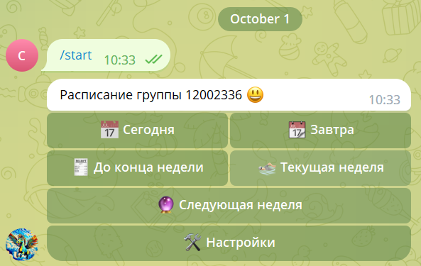
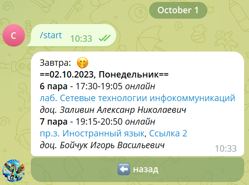
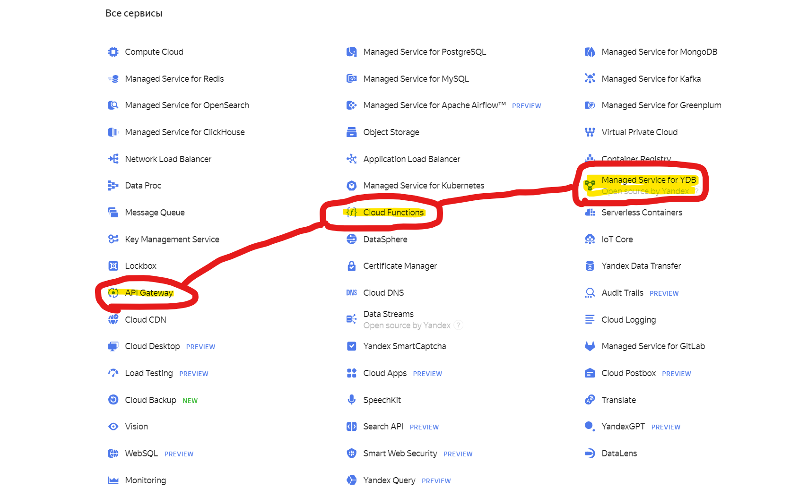

# 🤖 bsuTimetableClassesBot - A Telegram Schedule Bot

Welcome to [🤖 bsuTimetableClassesBot](https://t.me/bsuTimetableClassesBot) - a handy Telegram bot designed for the students of Belgorod State University. Get your class schedule directly on Telegram!

<p align="center">
  <a href="https://t.me/bsuTimetableClassesBot"></a>
  <a href="https://cloud.yandex.ru/"></a>
</p>

## 📖 Features

- 🛫 Start working with command `/start`.
- 🗿 You will come here if you call `/about`.
- 🆘 Ask for help if you get lost `/help`

## 📝 Sample Output




## 🛠 Configuration


1. env variables (bot token etc.)
2. Triggers for notifications function.

| Description  | cron triggers  |
|---|---|
| Два раза в день в 8 и в 20  | 0 5,17 ? 9-5 * *  |
| 3-4 пара. За 15 минут перед парами. utc=0 12:00 14:00  | 45 8,10 ? 9-5 2-7 *  |
| 2-7 пары. За 15 минут перед парами. utc=0 10:15 19:15  | 0 7,16 ? 9-5 2-7 *  |
| 5 пара. За 15 минут перед парами. utc=0 15:45  | 30 12 ? 9-5 2-7 *	  |
| 1-6 пара. За 15 минут перед парами. utc=0 8:30 17:30  | 15 5,14 ? 9-5 2-7 *  |


## 🚀 Getting Started

How to Use:

1. Create a Yandex Serverless Functions with the provided code.
2. Set up a Telegram Bot.
3. Connect the Yandex functions and the Telegram bot.
4. Create the Yandex Database and connect it to functions.
5. Set triggers for notifications function.
6. Delight in the convenience!



Also you can go to [🤖 BotFather](https://t.me/BotFather) and:

1. Call `/setcommands`
2. Choose your telegram bot
3. Set `menu` button:

```
start - Get started
about - About the project
help - Get help
```
4. Well done!

## 💸 Сost-price

The first million operations per month for Functions and Databases in Yandex Cloud are free. Then you will have to pay a few rubles, so be careful.

## ✍️ Author

This bot was crafted with ❤️ by a proud student.

📜 License

BSU © 2023 [👨‍⚕️ Duck Ever](https://t.me/duckever)


<p align="center">
  
</p>